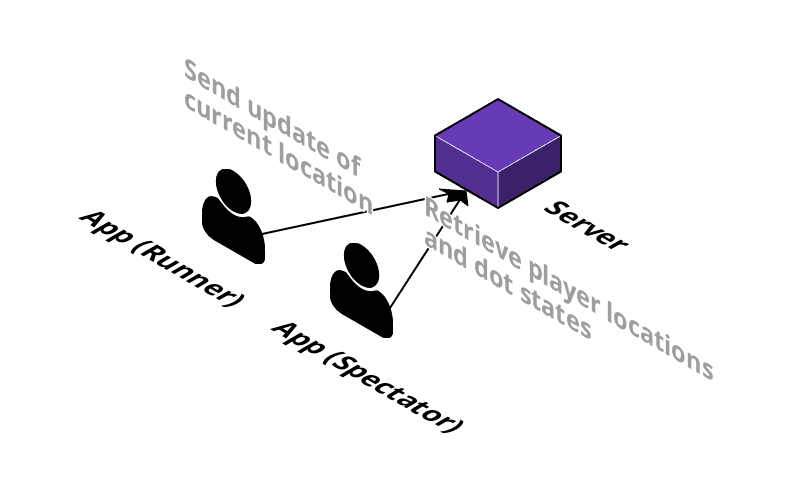

# Pac Macro Server (Node.js, TypeScript, and Express)

[](https://github.com/pacmacro/pm-server-node/blob/master/LICENSE)

Prototype server written in Node.js, TypeScript and Express for relaying information between mobile devices for the game Pac Macro.

The official specification for the game can be found [here](https://github.com/pacmacro/pm-specification).

[](https://cloudcraft.co/view/e364e7e3-cdc5-48e8-9b5f-82d7ba0d95a6?key=BhmvffJBoBU73zAUh8X22A&embed=true)

## API Documentation

For comprehensive and clear documentation, see [the wiki](https://github.com/pacmacro/pm-server/wiki/API-Documentation) from the Java implementation.

For example calls using cURL, see the directory [api-calls/](https://github.com/pacmacro/pm-server/tree/master/api-calls) from the Java implementation.

## Credits

This project is brought to you in part by:


* [Mobify](https://www.mobify.com/about/), a sponsor of this Pac Macro implementation
* [Andy Lumb (alumb)](https://github.com/alumb), the original creator of Pac Macro with the SFU CSSS

## Setup  

### For NodeJS and npm

First install NodeJS and npm if you don't have it [Download](https://nodejs.org/en/download/).

Once you install it, you will have to open up your terminal and type the commands below to check if it's properly installed.
```
npm -v      # Check the current version of your npm
node -v     # Check the current version of your NodeJS
```

### For TypeScript

You can install TypeScript by writing this command on your terminal like below, or click here [Download](https://www.typescriptlang.org/) for more informations.
```
npm i -g typescript     # install typescript globally
```

Once you've install everything above, open command line or terminal and run:
```
npm install
npm start
```
Now you should see:
```
[INFO] Server listening on http://localhost:3000.
```
You can check out the website by [Clicking This](http://localhost:3000).
Now you're done!

## Note: 

If you have problem install or execute those commands above because of permission especially on linux or mac, then add command ```sudo``` in front of those commands and type in your password